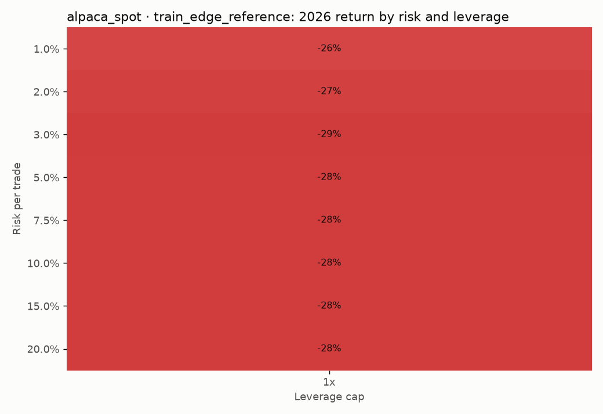
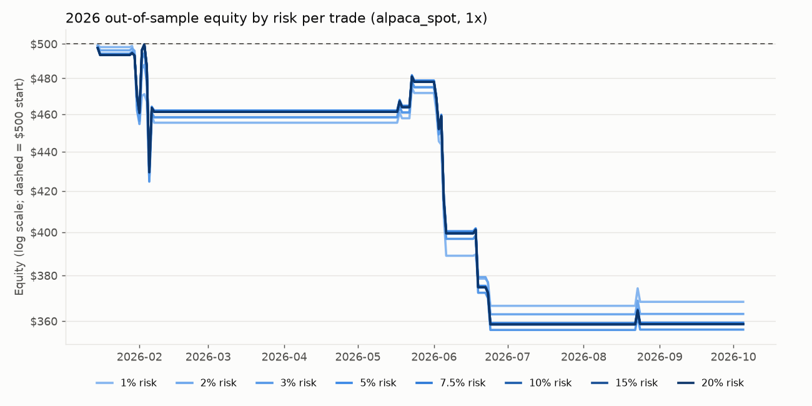
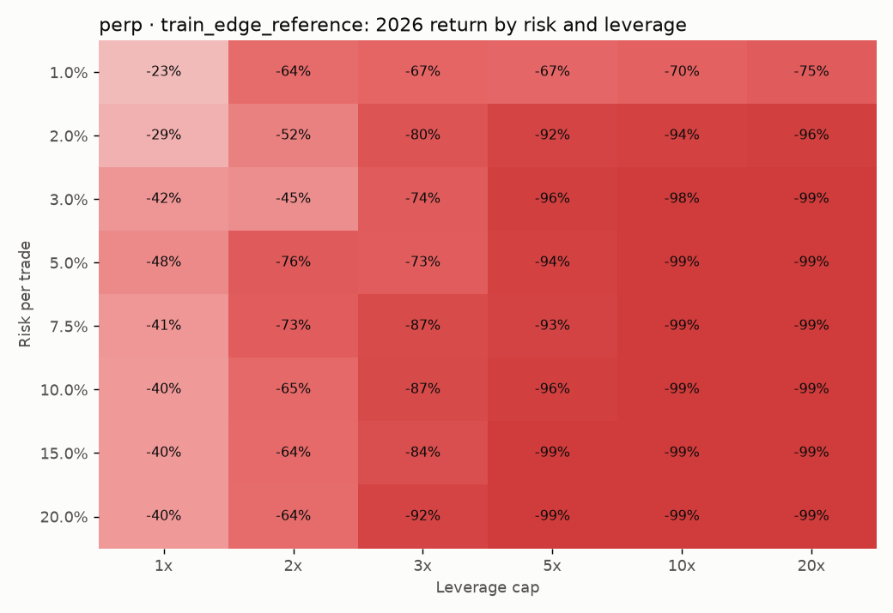
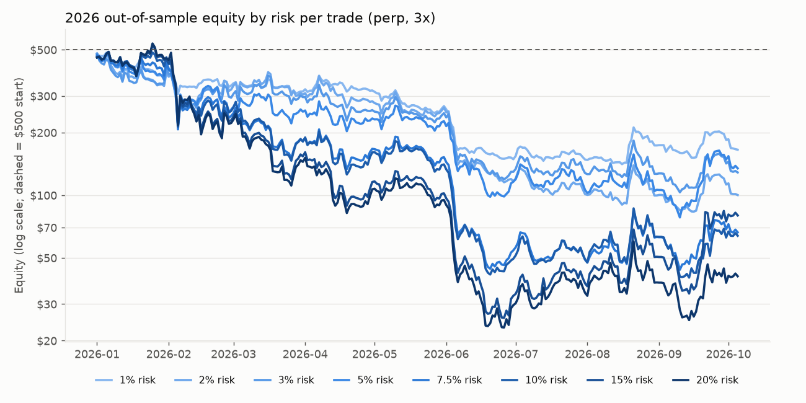

# 2026 out-of-sample test

## Headline (pre-registered before testing)

`alpaca_spot` · validated strategies · 1% risk per trade · 1x · circuit breakers on:

**No result: no strategy passed validation for this venue, so the headline portfolio is empty (the bot would not have traded).**

Everything after this section is sensitivity analysis. Picking the best cell after the fact is selection on the test set.

## Integrity

- ⚠️ **CONTAMINATED:** this freeze was created after 2026 had already been viewed. The strategies were still selected only on 2022–2025, but the choice of families was made knowing earlier 2026 results, so 2026 is not a clean test. Forward paper trading is.
- ⚠️ 2026 was tested 2 time(s) before this run (research/test_ledger.jsonl).
- ⚠️ 133 2026 data file(s) existed on disk before the freeze.
- Test window **2026-01-01 → 2026-10-06** (278 days); assets AVAX/USD, BTC/USD, DOGE/USD, ETH/USD, LINK/USD, LTC/USD, SOL/USD; start equity $500.
- Frozen 2026-10-06T18:03:07.802151+00:00 (sha256 `e033f5db421b3756…`, code `78fc4b07b28b…`) after searching **1720 configurations** on 2022–2024 and selecting on 2025.
- Costs: `alpaca_spot` = 0.25% fee + slippage 0.05% (BTC/ETH) or 0.15% (others) per side, long-only, 1x. `perp` = 0.05% fee + 0.03% slippage per side + the Binance funding actually settled while each trade was open (0.01%/8h where no rate is published yet), long+short, ≤ 20x, liquidation modeled.
- 2025 validation needs a day-clustered t ≥ 3 (about 0.07 champions would pass by chance). The exit `stop3.0xATR,rr10,hold24h` is in practice a 24h time exit.
- Survivorship: the universe is today's Alpaca coins, so coins that collapsed (LUNA, FTT) are missing; this flatters shorts less than longs but biases cross-sectional strategies.
- Drawdowns are mark-to-market on 5-minute closes; one position per asset; max 8 positions.
- "Circuit breakers" = no new entries after a 5% daily loss, and close everything + stop at a 15% drawdown. The bot's other limits (calibrated sizing, 6% heat cap, 30% notional cap) are NOT applied here, which is why 10–20% risk is even possible.

## Strategy champions (one per family and side, per venue)

**2 champion(s) beat the random-entry null; about 2.6 would by pure chance** (5% of those with test trades).

`beats_null` = test expectancy above the 95th percentile of 200 runs of the same strategy with all its entries shifted by one random number of whole days (same exits, trade counts, time of day and cross-asset clustering). `noise` = fewer than 40 test trades. Jan–Jun vs Jul–now: the families were designed by a model with training data to mid-2026, so Jul–now is the cleaner window.

### `alpaca_spot`

| family | side | tf | validated | train_pf | val_pf | val_t | test_trades | test_pf | test_exp_bps | test_t | exp_bps_jan_jun | exp_bps_jul_now | null_exp_bps | beats_null | noise | ret@1%,1x | ret@5%,1x | ret@10%,1x | ret@20%,1x |
|---|---|---|---|---|---|---|---|---|---|---|---|---|---|---|---|---|---|---|---|
| bb_reversion | long | 240 | no | 0.33 | 0.58 | -1.02 | 86 | 0.43 | -82.64 | -1.92 | -118.39 | -0.13 | -81.50 | no | no | -14.4% | -30.6% | -33.6% | -33.6% |
| btc_lead | long | 240 | no | 1.19 | 0.37 | -0.80 | 14 | 2.64 | 141.76 | 1.10 | -178.84 | 270.00 | -85.52 | yes | yes | +3.9% | +5.1% | +5.1% | +5.0% |
| climax_reversal | long | 240 | no | 2.38 | 1.35 | 0.37 | 12 | 1.05 | 13.51 | 0.03 | 13.51 | - | -68.62 | no | yes | -3.0% | +0.0% | -0.6% | -0.6% |
| daily_reversal | long | 15 | no | 1.51 | 0.82 | -0.54 | 77 | 0.31 | -186.63 | -1.75 | -199.66 | 0.92 | -72.79 | no | no | -26.3% | -28.1% | -28.3% | -28.3% |
| donchian_breakout | long | 240 | no | 0.95 | 0.77 | -1.18 | 274 | 0.69 | -53.49 | -1.46 | -112.55 | 33.24 | -80.35 | no | no | -27.0% | -33.1% | -32.0% | -32.0% |
| ema_cross | long | 240 | no | 0.90 | 0.82 | -0.61 | 82 | 0.66 | -55.39 | -1.15 | -134.75 | 68.61 | -77.07 | no | no | -5.0% | -36.6% | -38.5% | -38.5% |
| funding_contrarian | long | 240 | no | 0.92 | 0.65 | -1.76 | 81 | 0.63 | -67.96 | -1.38 | -98.60 | 47.41 | -68.99 | no | no | -9.9% | -38.4% | -45.3% | -45.3% |
| momentum_burst | long | 240 | no | 0.99 | 0.48 | -1.65 | 86 | 0.60 | -81.61 | -1.26 | -216.61 | 30.40 | -76.12 | no | no | -13.5% | -18.5% | -15.2% | -15.2% |
| mtf_pullback | long | 15 | no | 0.70 | 0.58 | -1.13 | 25 | 0.41 | -78.20 | -1.55 | -155.75 | 38.13 | -69.00 | no | yes | -9.9% | -12.7% | -12.7% | -12.7% |
| rsi2_reversion | long | 60 | no | 0.82 | 0.53 | -3.13 | 363 | 0.45 | -80.79 | -3.79 | -95.46 | -61.98 | -75.25 | no | no | -52.6% | -67.4% | -67.6% | -67.6% |
| session_breakout | long | 60 | no | 0.75 | 0.52 | -3.56 | 555 | 0.50 | -84.13 | -2.91 | -117.96 | -24.56 | -75.94 | no | no | -58.8% | -64.1% | -64.1% | -64.1% |
| squeeze_breakout | long | 240 | no | 0.96 | 0.48 | -2.19 | 111 | 0.53 | -88.23 | -1.66 | -144.10 | 23.52 | -70.80 | no | no | -12.7% | -20.5% | -17.2% | -17.2% |
| taker_flow | long | 240 | no | 0.64 | 0.57 | -2.14 | 118 | 0.48 | -83.70 | -2.57 | -116.02 | -31.27 | -76.28 | no | no | -21.8% | -45.3% | -46.4% | -46.4% |
| tsmom | long | 240 | no | 0.87 | 0.58 | -1.91 | 62 | 0.70 | -57.99 | -0.83 | -165.17 | -29.56 | -74.15 | no | no | -2.9% | -27.7% | -32.1% | -32.2% |
| vol_breakout | long | 60 | no | 0.73 | 0.56 | -2.96 | 364 | 0.70 | -44.20 | -1.41 | -69.62 | -5.37 | -79.08 | no | no | -27.0% | -29.9% | -29.0% | -29.0% |
| vwap_reclaim | long | 240 | no | 1.04 | 0.92 | -0.26 | 134 | 0.57 | -80.53 | -1.30 | -86.06 | -67.53 | -74.91 | no | no | -21.3% | -43.6% | -44.9% | -45.0% |
| xs_momentum | long | 240 | no | 0.79 | 0.54 | -4.45 | 278 | 0.42 | -100.47 | -5.63 | -111.45 | -79.99 | -76.01 | no | no | -49.4% | -93.4% | -94.7% | -94.7% |

### `perp`

| family | side | tf | validated | train_pf | val_pf | val_t | test_trades | test_pf | test_exp_bps | test_t | exp_bps_jan_jun | exp_bps_jul_now | null_exp_bps | beats_null | noise | ret@1%,3x | ret@5%,3x | ret@10%,3x | ret@20%,3x |
|---|---|---|---|---|---|---|---|---|---|---|---|---|---|---|---|---|---|---|---|
| bb_reversion | long | 15 | no | 0.94 | 0.87 | -1.26 | 1462 | 0.76 | -21.29 | -2.27 | -27.53 | -7.87 | -10.44 | no | no | -86.1% | -95.8% | -95.5% | -95.5% |
| bb_reversion | short | 60 | no | 0.90 | 1.09 | 0.64 | 788 | 0.79 | -24.09 | -1.55 | -13.44 | -41.04 | -9.91 | no | no | -60.8% | -79.2% | -84.8% | -88.2% |
| btc_lead | long | 15 | no | 1.19 | 1.01 | 0.02 | 112 | 1.26 | 23.11 | 0.48 | -84.75 | 90.34 | -14.43 | no | no | +5.8% | -20.3% | -17.8% | -9.9% |
| btc_lead | short | 240 | no | 0.88 | 2.40 | 0.88 | 18 | 3.16 | 155.60 | 0.88 | 188.29 | -7.84 | -6.05 | yes | yes | +9.9% | -2.7% | -5.9% | -5.9% |
| climax_reversal | long | 240 | no | 2.91 | 1.88 | 0.82 | 12 | 1.37 | 77.76 | 0.20 | 77.76 | - | -7.01 | no | yes | -1.7% | -0.4% | +12.0% | +4.5% |
| climax_reversal | short | 15 | no | 1.11 | 1.32 | 1.28 | 113 | 0.86 | -10.42 | -0.65 | -17.64 | 1.79 | -8.23 | no | no | -9.1% | -25.7% | -29.3% | -29.3% |
| daily_reversal | long | 15 | no | 1.87 | 1.02 | 0.06 | 77 | 0.44 | -127.71 | -1.29 | -140.92 | 62.52 | -14.82 | no | no | -29.8% | -49.4% | -50.0% | -49.1% |
| daily_reversal | short | 60 | no | 0.94 | 1.18 | 0.35 | 80 | 0.51 | -66.43 | -1.76 | -10.83 | -101.59 | -14.41 | no | no | -19.9% | -47.4% | -58.2% | -63.6% |
| donchian_breakout | long | 240 | no | 1.29 | 1.06 | 0.26 | 274 | 1.03 | 3.71 | 0.10 | -54.74 | 89.54 | -22.28 | no | no | +7.9% | -2.5% | +25.4% | +21.1% |
| donchian_breakout | short | 240 | no | 1.22 | 0.80 | -0.78 | 219 | 0.85 | -12.85 | -0.39 | -2.48 | -50.81 | -15.08 | no | no | -30.7% | -63.5% | -63.9% | -65.3% |
| ema_cross | long | 240 | no | 1.37 | 1.25 | 0.79 | 84 | 0.90 | -7.25 | -0.33 | -22.95 | 18.26 | -17.99 | no | no | -2.9% | -31.0% | -41.4% | -41.4% |
| ema_cross | short | 240 | no | 1.30 | 1.37 | 0.95 | 77 | 1.02 | 1.42 | 0.04 | 45.07 | -84.21 | -23.82 | no | no | -1.0% | -15.4% | -16.0% | -18.2% |
| funding_contrarian | long | 240 | no | 1.26 | 0.92 | -0.33 | 81 | 0.93 | -10.72 | -0.22 | -41.25 | 104.24 | -13.24 | no | no | +1.0% | -3.6% | -24.2% | -63.0% |
| funding_contrarian | short | 60 | no | 1.21 | 2.61 | 1.35 | 15 | 1.25 | 19.28 | 0.36 | 48.76 | -14.40 | -9.62 | no | yes | -1.1% | +1.6% | +6.2% | +6.2% |
| momentum_burst | long | 60 | no | 1.13 | 1.06 | 0.32 | 538 | 0.98 | -2.81 | -0.11 | -33.52 | 62.00 | -17.65 | no | no | -1.8% | -9.5% | +58.7% | +61.8% |
| momentum_burst | short | 240 | no | 0.93 | 0.42 | -1.88 | 62 | 0.77 | -28.88 | -0.47 | 8.40 | -120.00 | -12.04 | no | no | -11.8% | -40.9% | -54.2% | -59.1% |
| mtf_pullback | long | 15 | no | 1.09 | 0.92 | -0.16 | 25 | 0.74 | -23.49 | -0.49 | -99.84 | 91.04 | -14.29 | no | yes | -3.0% | -7.2% | -8.2% | -8.2% |
| mtf_pullback | short | 240 | no | 2.22 | 1.10 | 0.08 | 9 | 0.65 | -21.96 | -0.75 | -4.99 | -157.76 | -12.44 | no | yes | -1.7% | -6.6% | -6.1% | -6.1% |
| rsi2_reversion | long | 60 | no | 1.18 | 0.79 | -1.17 | 363 | 0.79 | -23.57 | -1.17 | -37.38 | -5.85 | -17.90 | no | no | -21.6% | -65.9% | -74.5% | -78.2% |
| rsi2_reversion | short | 240 | no | 1.15 | 1.09 | 0.39 | 272 | 0.79 | -24.24 | -0.80 | -22.66 | -31.42 | -10.73 | no | no | -13.3% | -31.1% | -13.3% | +28.8% |
| session_breakout | long | 60 | no | 1.08 | 0.79 | -1.32 | 555 | 0.80 | -26.42 | -0.92 | -59.89 | 32.52 | -17.94 | no | no | -41.7% | -69.2% | -73.0% | -72.3% |
| session_breakout | short | 15 | no | 1.01 | 0.89 | -0.75 | 661 | 0.82 | -16.65 | -1.11 | -3.81 | -43.84 | -11.76 | no | no | -52.5% | -23.1% | -18.6% | -18.6% |
| squeeze_breakout | long | 240 | no | 1.30 | 0.68 | -1.18 | 111 | 0.79 | -31.97 | -0.61 | -87.95 | 80.00 | -13.58 | no | no | -2.4% | -12.4% | -18.9% | -13.1% |
| squeeze_breakout | short | 240 | no | 1.20 | 1.07 | 0.18 | 66 | 0.48 | -49.81 | -1.55 | -43.30 | -70.17 | -14.37 | no | no | -15.0% | -35.3% | -38.6% | -38.9% |
| taker_flow | long | 240 | no | 1.04 | 0.89 | -0.43 | 118 | 0.80 | -25.05 | -0.78 | -57.57 | 27.71 | -17.22 | no | no | -5.3% | -19.2% | -46.9% | -53.4% |
| taker_flow | short | 240 | no | 1.20 | 1.07 | 0.30 | 233 | 1.10 | 9.15 | 0.42 | 39.51 | -48.92 | -10.18 | no | no | +1.3% | -21.2% | +9.9% | +51.8% |
| tsmom | long | 240 | no | 1.17 | 0.82 | -0.69 | 62 | 1.00 | -0.09 | -0.00 | -105.77 | 27.95 | -15.05 | no | no | +3.3% | +0.8% | -24.1% | -43.9% |
| tsmom | short | 240 | no | 1.21 | 0.58 | -2.18 | 88 | 0.72 | -28.78 | -0.75 | -29.73 | -15.85 | -14.88 | no | no | -10.3% | -17.9% | -12.3% | -13.9% |
| vol_breakout | long | 15 | no | 1.06 | 0.97 | -0.14 | 447 | 1.06 | 6.17 | 0.26 | -16.84 | 40.00 | -11.57 | no | no | +8.2% | +49.0% | +52.6% | +56.0% |
| vol_breakout | short | 240 | no | 0.98 | 1.04 | 0.16 | 330 | 0.94 | -4.52 | -0.19 | 24.49 | -62.53 | -13.01 | no | no | -31.3% | -54.3% | -61.7% | -62.1% |
| vwap_reclaim | long | 240 | no | 1.41 | 1.23 | 0.62 | 134 | 0.85 | -24.09 | -0.40 | -29.41 | -11.60 | -18.34 | no | no | -6.3% | -28.9% | -44.8% | -61.5% |
| vwap_reclaim | short | 60 | no | 0.96 | 0.88 | -0.77 | 381 | 0.95 | -5.17 | -0.27 | 14.76 | -41.08 | -4.85 | no | no | -21.3% | -44.1% | -44.2% | -48.1% |
| xs_momentum | long | 240 | no | 1.09 | 0.77 | -1.83 | 278 | 0.68 | -43.85 | -2.46 | -55.11 | -22.82 | -19.15 | no | no | -21.3% | -75.6% | -95.3% | -99.0% |
| xs_momentum | short | 240 | no | 1.00 | 0.99 | -0.05 | 278 | 0.90 | -12.03 | -0.67 | 9.48 | -52.18 | -9.61 | no | no | -15.4% | -62.5% | -85.4% | -86.2% |

## Combined portfolios: return by risk per trade × leverage (sensitivity)

### `alpaca_spot` · train_edge_reference · raw (1 strategies) — reference only, includes strategies 2025 rejected

Return % (max mark-to-market drawdown %):

| risk | 1x |
|---|---|
| 1.0% risk | -26.3% (28%) |
| 2.0% risk | -27.4% (29%) |
| 3.0% risk | -28.7% (30%) |
| 5.0% risk | -28.1% (30%) |
| 7.5% risk | -28.3% (30%) |
| 10.0% risk | -28.3% (30%) |
| 15.0% risk | -28.3% (30%) |
| 20.0% risk | -28.3% (30%) |

### `alpaca_spot` · train_edge_reference · with circuit breakers (5% daily stop, 15% DD close-all + halt) (1 strategies) — reference only, includes strategies 2025 rejected

Return % (max mark-to-market drawdown %):

| risk | 1x |
|---|---|
| 1.0% risk | -15.9% (16%) |
| 2.0% risk | -15.0% (15%) |
| 3.0% risk | -14.5% (15%) |
| 5.0% risk | -14.4% (15%) |
| 7.5% risk | -14.4% (15%) |
| 10.0% risk | -14.4% (15%) |
| 15.0% risk | -14.4% (15%) |
| 20.0% risk | -14.4% (15%) |

### `perp` · train_edge_reference · raw (16 strategies) — reference only, includes strategies 2025 rejected

Return % (max mark-to-market drawdown %):

| risk | 1x | 2x | 3x | 5x | 10x | 20x |
|---|---|---|---|---|---|---|
| 1.0% risk | -23.4% (34%) | -63.6% (68%) | -66.9% (72%) | -66.7% (76%) | -70.0% (78%) | -74.5% (80%) |
| 2.0% risk | -28.6% (48%) | -52.4% (61%) | -80.0% (84%) | -91.8% (93%) | -94.3% (96%) | -95.9% (98%) |
| 3.0% risk | -41.7% (56%) | -45.4% (61%) | -74.3% (80%) | -96.1% (97%) | -98.3% (99%) | -99.0% (99%) |
| 5.0% risk | -47.9% (64%) | -75.7% (82%) | -73.1% (85%) | -94.3% (96%) | -99.0% (99%) | -99.0% (99%) |
| 7.5% risk | -40.6% (65%) | -73.3% (83%) | -86.7% (92%) | -92.5% (96%) | -99.0% (99%) | -99.0% (99%) |
| 10.0% risk | -39.9% (64%) | -64.7% (87%) | -87.2% (93%) | -96.3% (98%) | -99.0% (99%) | -99.5% (99%) |
| 15.0% risk | -39.7% (64%) | -64.3% (88%) | -84.0% (96%) | -99.0% (99%) | -99.0% (99%) | -99.1% (99%) |
| 20.0% risk | -39.7% (64%) | -63.6% (87%) | -91.8% (96%) | -99.0% (99%) | -99.0% (99%) | -99.1% (99%) |

Ruined (equity < 1% of start): 3.0% @ 20x, 5.0% @ 10x, 5.0% @ 20x, 7.5% @ 10x, 7.5% @ 20x, 10.0% @ 10x, 10.0% @ 20x, 15.0% @ 5x, 15.0% @ 10x, 15.0% @ 20x, 20.0% @ 5x, 20.0% @ 10x, 20.0% @ 20x

### `perp` · train_edge_reference · with circuit breakers (5% daily stop, 15% DD close-all + halt) (16 strategies) — reference only, includes strategies 2025 rejected

Return % (max mark-to-market drawdown %):

| risk | 1x | 2x | 3x | 5x | 10x | 20x |
|---|---|---|---|---|---|---|
| 1.0% risk | -15.1% (15%) | -15.3% (15%) | -15.6% (16%) | -15.5% (16%) | -15.8% (16%) | -15.7% (16%) |
| 2.0% risk | -14.4% (15%) | -15.2% (15%) | -15.6% (16%) | -15.6% (16%) | -16.1% (16%) | -15.8% (16%) |
| 3.0% risk | -15.2% (16%) | -15.3% (15%) | -15.8% (16%) | -14.9% (15%) | -16.8% (17%) | -19.7% (20%) |
| 5.0% risk | -9.7% (15%) | -14.7% (16%) | -15.9% (16%) | -15.3% (16%) | -15.9% (16%) | -14.9% (15%) |
| 7.5% risk | -9.1% (15%) | -16.7% (18%) | -14.8% (15%) | -15.5% (16%) | -17.1% (17%) | -14.8% (15%) |
| 10.0% risk | -9.1% (15%) | -17.0% (19%) | -15.3% (16%) | -16.4% (17%) | -15.1% (16%) | -16.8% (17%) |
| 15.0% risk | -9.1% (15%) | -17.0% (19%) | -15.5% (16%) | -15.1% (16%) | -16.3% (17%) | -41.0% (42%) |
| 20.0% risk | -9.1% (15%) | -17.0% (19%) | -15.5% (16%) | -14.5% (16%) | -14.8% (16%) | -14.8% (16%) |

